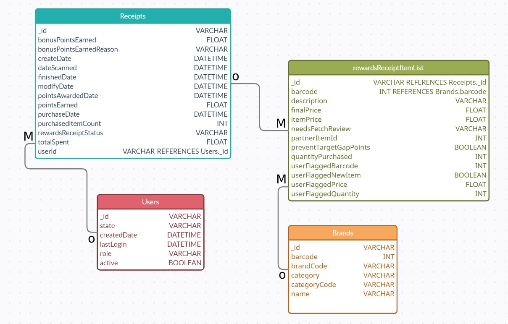
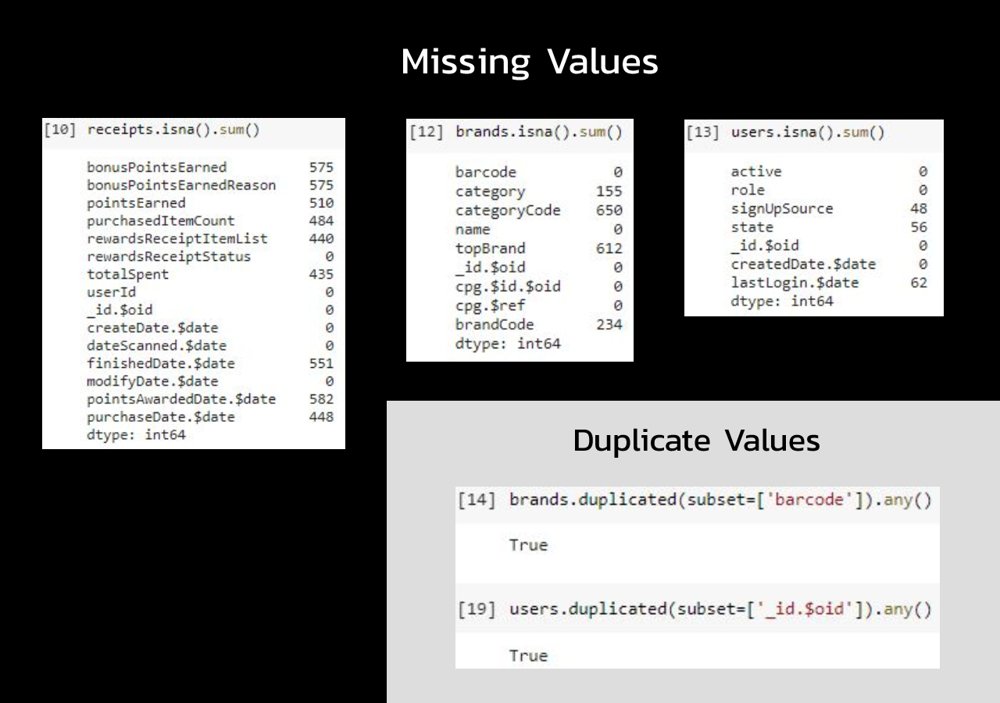

# Assesment Submission
Akash Negi | akashxn@icloud.com

**Note:** Everything could be understood using just this readme file, but feel free to check "fr.ipynb" for python code and "fr_SQL.txt" for SQL code.
<br>

# First: Review Existing Unstructured Data and Diagram a New Structured Relational Data Model



<br>


# Second: Write a query that directly answers a predetermined question from a business stakeholder

### 1) What are the top 5 brands by receipts scanned for most recent month?

```sql

SELECT Brands.name, count(*) Total
FROM Receipts
RIGHT JOIN rewardsReceiptItemList
 ON Receipt._id = rewardsReceiptItemList._id
LEFT JOIN Brands
 ON Brands.barcode = rewardsReceiptItemList.barcode
WHERE month(Receipts.createDate) = month(now())
AND
year(Receipts.createDate) = year(now())
GROUP BY Brands.name
ORDER BY Total DESC
LIMIT 5;

```

### 2) How does the ranking of the top 5 brands by receipts scanned for the recent month compare to the ranking for the previous month?

```sql
SELECT * FROM
(
SELECT Brands.name, month(Receipt.createDate)
       RANK() OVER(PARTITION BY month(Receipt.createDate) ORDER BY count(*) DESC) Rank
FROM Receipts
RIGHT JOIN rewardsReceiptItemList
 ON Receipt._id = rewardsReceiptItemList._id
LEFT JOIN Brands
 ON Brands.barcode = rewardsReceiptItemList.barcode
WHERE (month(Receipts.createDate) = month(now()) AND year(Receipts.createDate) = year(now())) OR 
(month(Receipts.createDate) = month(now())-1 AND year(Receipts.createDate) = year(now())-1)
) a

WHERE a.Rank <=  5;

```


### 3) When considering average spend from receipts with 'rewardsReceiptStatus’ of ‘Accepted’ or ‘Rejected’, which is greater?

```sql
SELECT AVG(totalSpent) AS avgSpend
FROM Receipts
WHERE rewardsReceiptStatus = 'Accepted';

SELECT AVG(totalSpent) AS avgSpend
FROM Receipts
WHERE rewardsReceiptStatus = 'Rejected';

```

### 4) When considering total number of items purchased from receipts with 'rewardsReceiptStatus’ of ‘Accepted’ or ‘Rejected’, which is greater?
```sql
SELECT SUM(purchasedItemCount) AS totalItemsPurchased
FROM Receipts
WHERE rewardsReceiptStatus = 'Accepted';

SELECT SUM(purchasedItemCount) AS totalItemsPurchased
FROM Receipts
WHERE rewardsReceiptStatus = 'Rejected';

```

### 5) Which brand has the most spend among users who were created within the past 6 months?
```sql
SELECT Brand.name, SUM(Receipts.totalSpent) AS spend
FROM Receipts
RIGHT JOIN rewardsReceiptItemList
 ON Receipt._id = rewardsReceiptItemList._id
LEFT JOIN Brands
 ON Brands.barcode = rewardsReceiptItemList.barcode
LEFT JOIN Users
 ON Receipts.userId = Users._id
WHERE Users.CreatedDate >= DATE_SUB(now(), INTERVAL 6 month)
GROUP BY Brand.name
ORDER BY spend DESC
LIMIT 1;
```


### 6) Which brand has the most transactions among users who were created within the past 6 months?
```sql
SELECT Brand.name, COUNT(Receipts.totalSpent) AS transactions
FROM Receipts
RIGHT JOIN rewardsReceiptItemList
 ON Receipt._id = rewardsReceiptItemList._id
LEFT JOIN Brands
 ON Brands.barcode = rewardsReceiptItemList.barcode
LEFT JOIN Users
 ON Receipts.userId = Users._id
WHERE Users.CreatedDate >= DATE_SUB(now(), INTERVAL 6 month)
GROUP BY Brand.name
ORDER BY transactions DESC
LIMIT 1;

```

# Third: Evaluate Data Quality Issues in the Data Provided

I used Python (pandas) to check for missing values and duplicates. If given more time, I would check for distribution and outliers as well. But for now, here are the results.



<br>

There are a lot of missing values (refer to above image or fr.ipynb for code).
<br>
**Receipts:**
- Multiple missing values in columns.
- Most important ones being totalSpent, purchasedItemCount and purchaseDate

**Brands:**
- category and categoryCode missing for most of the brands.
- Duplicate barcode values

**Users:**
- signUpSource missing for most of the users, which plays a key role in tracking marketing efforts.
- Duplicate userId, should be unique for each user.


# Fourth: Communicate with Stakeholders

Hi [first name],

Hope all is well. I just wanted to let you know that I set up a new data warehourse for all of our data and am in the process of analyzing it. I have a couple of questions regarding the way we get data and some insights for you.
I discoverd some data quality issues which might have something to do with the way we get our data / 3rd party services we use to gather data. There is a lot of missing data for customers. For example, we do not have Sign Up Source for multiple users. This piece of information would be crucial for our marketing efforts and to better understand where our customers are coming from. Now, talking about Brands, a lot of brand categories are missing too. In addition to this, we somehow have duplicate barcodes for unique products which might cause issues in future. I would like to know if we are tracking signup source for our users using a third party service or inhouse? Based on that I can suggest ways to improve. Also if you can help me understand why we do not have unique barcodes for some products, that would be helpful for my workflow and analysis.
In order to better fulfill the company's data and reporting needs, I would like to know if there are any specific areas we would like to improve on or pay more attention to? I can cater to that specifically. Are there any specific reports/insights you would like me to deliver that helps you with decision making? Feel free to reach out anytime for any ad-hoc reports.
As our company is growing rapidly, are you looking at alternative data sources in the near future? Maybe we could make use of some more demographics data and Ad campaign data. This would help us better track our user behaviour and we can run targeted Ads based on that.
Speaking about future growth, out data is constantly growing and right now we are hosting all of it locally. For future I would suggest we move everything to cloud like AWS or Azure. Doing this would help up scale without any problems and our data can be accessed at higher speeds as it grows exponentially.


